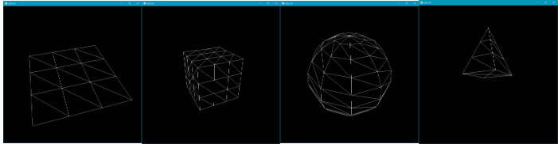
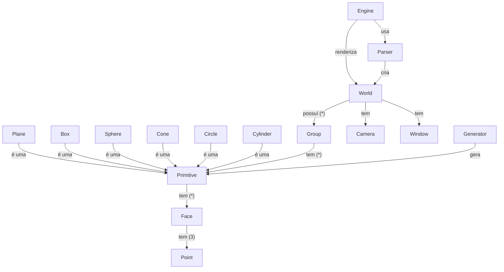
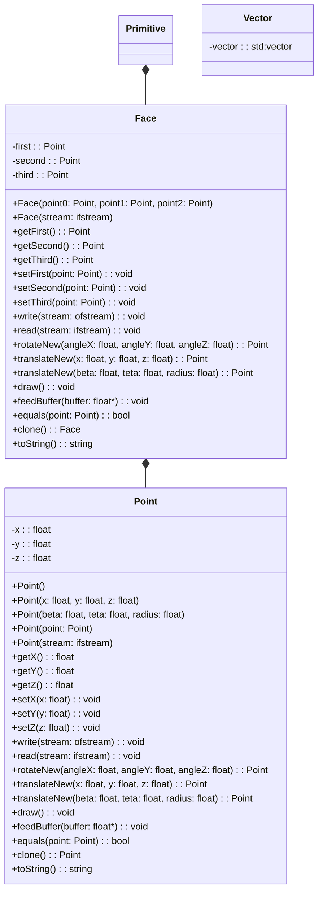

# Computação Gráfica UM 2024 - Motor Gráfico

Pretende-se implementar um motor gráfico simples que consiga representar várias figuras geométricas tridimensionais, usando a linguagem de programação **[C++](https://cplusplus.com/)**.

O projeto será baseada na interface gráfica **[OpenGL](https://www.opengl.org/)** através da utilização da biblioteca **[GLUT](https://www.opengl.org/resources/libraries/glut/)**.

A implementação será divida em **cinco fases**, sendo a última fase utilizada para a implementação de extras que se considerem interessantes para o bom funcionamento do projeto.

A solução criada deverá, ainda, ser constituída por um **[Gerador de Primitivas](#gerador-de-primitivas)** e um **[Motor Gráfico](#motor-gráfico)**, que deverão, como os nomes indicam, gerar e representar primitivas geométricas, respetivamente, dada uma certa configuração.

---

# Gerador de primitivas

O gerador de primitivas geométricas será responsável pela geração de primitivas e suas propriedades, tal que, o único trabalho que o **[Motor Gráfico](#motor-gráfico)** possa ter neste contexto seja o de representar estas figuras.

## Gerador de figuras (Fase 1)

Numa primeira solução, define-se o simples objetivo de geração única dos vértices necessários para a representação dos modelos geométricos.

Estes vértices deverão ser construídos e armazenados num documento com extensão `.3d` tal que possam ser lidos pelo **[Motor Gráfico](#motor-gráfico)** de forma a gerarem figuras geométricas.

### Primitivas geométricas

Foi definida, portanto, uma lista de primitivas geométricas que se pretendem implementar nesta fase inicial.

- [ ] Plano (Plane)
- [ ] Cubo (Box)
- [ ] Esfera (Sphere)
- [ ] Cone (Cone)
- [ ] Círculo (Circle)
- [ ] Cilindro (Cylinder)

Cada uma destas figuras deverá, no ato da sua criação, receber determinados parâmetros que deverão especificar a sua estrutura.

| Primitiva Geométrica | Comprimento      | Raio             | Altura           | Divisões         | Fatias           |Pilhas            |
|----------------------|------------------|------------------|------------------|------------------|------------------|------------------|
| Plano                |:white_check_mark:|:x:               |:x:               |:white_check_mark:|:x:               |:x:               |
| Cubo                 |:white_check_mark:|:x:               |:x:               |:white_check_mark:|:x:               |:x:               |
| Esfera               |:x:               |:white_check_mark:|:x:               |:x:               |:white_check_mark:|:white_check_mark:|
| Cone                 |:x:               |:white_check_mark:|:white_check_mark:|:x:               |:white_check_mark:|:white_check_mark:|
| Círculo              |:x:               |:white_check_mark:|:x:               |:x:               |:white_check_mark:|:x:               |
| Cilindro             |:x:               |:white_check_mark:|:white_check_mark:|:x:               |:white_check_mark:|:white_check_mark:|

Estas primitivas deverão, então, ser geradas através do comando `generator` fornecendo a este os argumentos necessários (figura pretendida, propriedades da figura e ficheiro de armazenamento).

O comando será dado, portanto, por `$ generator primitiva length divisions ... path/to/file.3d`, como é possível observar nos seguintes exemplos:

- ``` 
  # Gerar um plano de comprimento 1 com 3 divisões
  $ generator plane 1 3 plane.3d 
  ```
- ``` 
  # Gerar um cubo de lado 2 com 3 divisões em cada face
  $ generator box 2 3 box.3d 
  ```
- ``` 
  # Gerar um cone de raio 1, altura 5, dividido em 4 fatias
  # e 3 montes
  $ generator cone 1 5 4 3 cone.3d 
  ```
- ``` 
  # Gerar uma esfera de raio 1, dividida em 10 fatias e
  # 10 montes
  $ generator sphere 1 10 10 sphere.3d 
  ```
- ``` 
  # Gerar um circulo de raio 3, dividida em 10 fatias
  $ generator circle 3 10 circle.3d 
  ```
- ``` 
  # Gerar um cilindro de raio 3 e 6 de altura, dividido em
  # 10 fatias e 2 montes
  $ generator cylinder 3 6 10 2 cylinder.3d 
  ```

---

### Formato do ficheiro .3d

Para armazenar estas estruturas de forma eficaz e íntegra foi definido, ainda, um formato de ficheiro capaz de guardar todos os vértices e faces que constituem uma primitiva.

O ficheiro deverá, portanto, começar por armazenar todos os vértices de uma primitiva, que serão indexados pela ordem de aparição no ficheiro (primeiro vértice -> 0, etc...).

De seguida, estarão presentes as faces que irão ser definidas por 3 pontos identificados pelo respetivo índice (ou seja, face x -> 1 0 2 (pontos 1, 0 e 2)).

O ficheiro terá, portanto, a seguinte estrutura.

```
# Número de vértices
N
# Lista de coordenadas dos vértices
x0 y0 z0
x1 y1 z1
...
# Número de faces
M
# Lista de faces
i0 i1 i2
...
```

Ou seja, por exemplo, um ficheiro que define uma face, seria definido da seguinte forma.

```
3
0.0 0.0 0.0
1.0 0.0 0.0
0.0 0.0 1.0
1
1 0 2
```

---

# Motor Gráfico

O motor gráfico, em contraste com o gerador de primitivas, apenas possuirá o trabalho de representar as primitivas anteriormente geradas.

Será necessário respeitar as propriedades estabelecidas pelos ficheiros `.3d` gerados, e pelo documento `XML` que estabelece as regras e transformações do cenário.

## Representação de figuras (Fase 1)

Numa primeira fase, apenas será necessária haver preocupação na representação das figuras já estabelecidas pelo **[Gerador de Primitivas](#gerador-de-primitivas)**, assim como da criação da câmera e janela que as vai visualizar.

Dessa forma, deverão ser tidas em conta algumas etiquetas `XML` para a criação de representações nesta primeira etapa.

| Etiqueta | Definição                                     | Lista de propriedades | Etiqueta Mãe |
|----------|-----------------------------------------------|-----------------------|--------------|
|world     | Define o contexto do cenário                  | axis                  |:x:           |
|window    | Define as propriedades da janela de exibição  | width, height         | world        |
|camera    | Define a uma câmera para visualização         | (sub-etiquetas)       | world        |
|position  | Define a posição da câmera no cenário         | x, y, z               | camera       |
|lookAt    | Define o ponto de "foco" da câmera            | x, y, z               | camera       |
|up        | Define o vetor "up" da câmera                 | x, y, z               | camera       |
|projection| Define as propriedades de projeção da câmera  | fov, near, far        | camera       |
|group     | Define um grupo de representação              |:x:                    | world        |
|models    | Define um grupo de objetos para representação |:x:                    | group        |
|model     | Define um objeto singular para representação  | file                  | models       |

Estas etiquetas deverão, então, definir uma configuração de um cenário, que deverá ser lida pelo motor e representada no ecrã de acordo. Um exemplo de uma configuração com esta hierarquia pode, portanto, ser o seguinte.

```
<world>
    <window width="512" height="512" />
    <camera>
        <position x="3" y="2" z="1" />
        <lookAt x="0" y="0" z="0" />
        <up x="0" y="1" z="0" />
        <projection fov="60" near="1" far="1000" />
    </camera>
    <group>
        <models>
            <model file="plane.3d" />
            <model file="cone.3d" />
        </models>
    </group>
</world>
```

A leitura de uma configuração deverá ser feita numa única vez, sendo que a sua informação deverá ser armazenada em estruturas de dados que consiga criar as representações pretendidas.

Este motor simples terá de originar, portanto, figuras semelhantes às seguintes.



---

# Estrutura da solução

## Fase 1

### Conceptualização

Definidos os objetivos da fase inicial, é proposta uma solução que baseia a sua estrutura nas hierarquias definidas anteriormente, considerando ambas as hierarquias propostas no **[Gerador](#gerador-de-primitivas)** e no **[Motor](#motor-gráfico)**.

Devido à necessidade de leitura e armazenamento da estruturação dos vértices e das faces definidos para cada primitiva nos seus ficheiros, optou-se pela implementação de uma espécie de *Middleware*, que tenciona manter, em memória, uma arquitetura "idêntica" das estruturas partilhadas por ambos os programas da solução, simplificando o processo de leitura, escrita e representação para ambos os lados.

Desta forma, é proposto o seguinte **Modelo de Domínio**, que tenciona descrevar esta proposta de forma mais detalhada.



Criado o modelo, é possível perceber a hierarquia utilizada para a sua definição.

O gerador irá, portanto, ser responsável pela criação de primitivas que serão definidas pelas respetivas faces, que por sua vez são constituídas pelos seus pontos.

Estas primitivas poderão ser do tipo **caixa, esfera, etc.** que, por sua vez, definirão os processos necessários para a construção de pontos e faces que bem definam a sua estrutura.

O motor usará esta noção de primitiva, também, porém não utilizará a definições mais especificas (**esfera, etc.**), visto que as faces e pontos lidos deverão ser mais que suficientes para a boa representação das figuras pretendidas.

Fará uso, ainda, a um interpretador que irá ler uma configuração `XML` e criará um mundo (com os seus respetivos grupos, câmera, etc.), em memória, de acordo que será posteriormente utilizado para a representação de configuração pretendida pelo utilizador na janela do motor.

---

### Implementação

Estruturada a arquitetura base da solução, foi proposto, ainda, um modelo que conseguisse especificar como a solução vai ser implementada de forma concreta, tentando demonstrando e especificar todas as decisões de implementação tomadas para a melhor concretização do projeto pretendido.



---

# Utilização dos scripts

Foram ainda criados scripts de compilação e execução do projeto que podem ser encontrados na diretoria `scripts`. Estes scripts podem ser utilizados para aplicar a configuração do `CMakeLists.txt` (`configure.sh`) e para a compilação da solução (`build.sh`).

Estes precisam, no entanto, de permissão para serem executados pelo que deverão ser executados da seguinte forma:

```
sudo ./scripts/script.sh
```

ou, para uma solução mais permanente:

```
sudo chmod +x scripts/script.sh
./scripts/script.sh
```