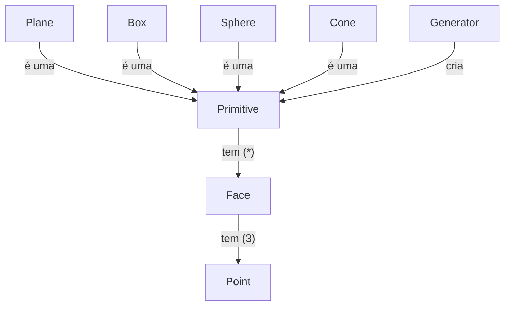
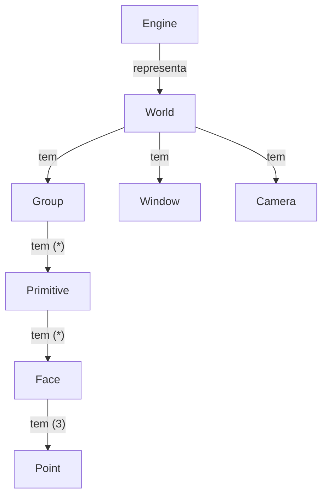

# Computação Gráfica UM 2024 - Motor Gráfico

Pretende-se implementar um motor gráfico simples que consiga representar várias figuras geométricas tridimensionais, usando a linguagem de programação **[C++](https://cplusplus.com/)**.

O projeto será baseada na interface gráfica **[OpenGL](https://www.opengl.org/)** através da utilização da biblioteca **[GLUT](https://www.opengl.org/resources/libraries/glut/)**.

A implementação será divida em **cinco fases**, sendo a última fase utilizada para a implementação de extras que se considerem interessantes para o bom funcionamento do projeto.

A solução criada deverá, ainda, ser constituída por um **[Gerador de Primitivas](#gerador-de-primitivas)** e um **[Motor Gráfico](#motor-gráfico)**, que deverão, como os nomes indicam, gerar e representar primitivas geométricas, respetivamente, dada uma certa configuração.

---

# Gerador de primitivas

O gerador de primitivas geométricas será responsável pela geração de primitivas e suas propriedades, tal que, o único trabalho que o **[Motor Gráfico](#motor-gráfico)** possa ter neste contexto seja o de representar estas figuras.

## Gerador de figuras (Fase 1)

Numa primeira solução, define-se o simples objetivo de geração única dos vértices necessários para a representação dos modelos geométricos.

Estes vértices deverão ser construídos e armazenados num documento com extensão `.3d` tal que possam ser lidos pelo **[Motor Gráfico](#motor-gráfico)** de forma a gerarem figuras geométricas.

### Primitivas geométricas

Foi definida, portanto, uma lista de primitivas geométricas que se pretendem implementar nesta fase inicial.

- [x] Plano (Plane)
- [x] Cubo (Box)
- [x] Esfera (Sphere)
- [x] Cone (Cone)
- [ ] Círculo (Circle)
- [ ] Cilindro (Cylinder)

Cada uma destas figuras deverá, no ato da sua criação, receber determinados parâmetros que deverão especificar a sua estrutura.

| Primitiva Geométrica | Comprimento      | Raio             | Altura           | Divisões         | Fatias           |Pilhas            |
|----------------------|------------------|------------------|------------------|------------------|------------------|------------------|
| Plano                |:white_check_mark:|:x:               |:x:               |:white_check_mark:|:x:               |:x:               |
| Cubo                 |:white_check_mark:|:x:               |:x:               |:white_check_mark:|:x:               |:x:               |
| Esfera               |:x:               |:white_check_mark:|:x:               |:x:               |:white_check_mark:|:white_check_mark:|
| Cone                 |:x:               |:white_check_mark:|:white_check_mark:|:x:               |:white_check_mark:|:white_check_mark:|
| Círculo              |:x:               |:white_check_mark:|:x:               |:x:               |:white_check_mark:|:x:               |
| Cilindro             |:x:               |:white_check_mark:|:white_check_mark:|:x:               |:white_check_mark:|:white_check_mark:|

Estas primitivas deverão, então, ser geradas através do comando `generator` fornecendo a este os argumentos necessários (figura pretendida, propriedades da figura e ficheiro de armazenamento).

O comando será dado, portanto, por `$ generator primitiva length divisions ... path/to/file.3d`, como é possível observar nos seguintes exemplos:

- ``` 
  # Gerar um plano de comprimento 1 com 3 divisões
  $ generator plane 1 3 plane.3d 
  ```
- ``` 
  # Gerar um cubo de lado 2 com 3 divisões em cada face
  $ generator box 2 3 box.3d 
  ```
- ``` 
  # Gerar um cone de raio 1, altura 5, dividido em 4 fatias
  # e 3 montes
  $ generator cone 1 5 4 3 cone.3d 
  ```
- ``` 
  # Gerar uma esfera de raio 1, dividida em 10 fatias e
  # 10 montes
  $ generator sphere 1 10 10 sphere.3d 
  ```
- ``` 
  # Gerar um circulo de raio 3, dividida em 10 fatias
  $ generator circle 3 10 circle.3d 
  ```
- ``` 
  # Gerar um cilindro de raio 3 e 6 de altura, dividido em
  # 10 fatias e 2 montes
  $ generator cylinder 3 6 10 2 cylinder.3d 
  ```

---

### Formato do ficheiro .3d

Para armazenar estas estruturas de forma eficaz e íntegra foi definido, ainda, um formato de ficheiro capaz de guardar todos os vértices e faces que constituem uma primitiva.

De forma a ter uma leitura rápida e eficaz, decidiu-se usar uma arquitetura binária, facilitando o armazenamento e leitura das variáveis flutuantes devido a não necessidade de fazer a conversão das mesmas para um formato de texto.

Os valores dos pontos serão armazenados, portanto, de forma contínua, sendo que a cada três valores flutuantes existe um ponto, e a cada três pontos (ou nove valores) existe uma face. O conjunto de pontos guardados nestes ficheiros irá, portanto, definir um conjunto de faces que, por sua vez, definirão uma primitiva.

A quantidade de valores flutuantes será, portanto, sempre múltipla de três.

Esta estrutura pode ser vista, de forma simplificada e considerando os espaços como inexistentes, da seguinte forma:

```
0.0000 0.0000 0.0000 (em binário) | Face1
...Ponto2...                      | Face1
...Ponto3...                      | Face1
...Ponto4...                      | Face2
...Ponto5...                      | Face2
...Ponto6...                      | Face2
...Ponto7...                      | Face3
...                               ...
...
```

Ou seja, por exemplo, um ficheiro que define uma face, seria definido da seguinte forma.

```
0.0000 0.0000 0.0000
1.0000 0.0000 0.0000
0.0000 0.0000 1.0000
(tudo em formato binário)
```

---

# Motor Gráfico

O motor gráfico, em contraste com o gerador de primitivas, apenas possuirá o trabalho de representar as primitivas anteriormente geradas.

Será necessário respeitar as propriedades estabelecidas pelos ficheiros `.3d` gerados, e pelo documento `XML` que estabelece as regras e transformações do cenário.

## Representação de figuras (Fase 1)

Numa primeira fase, apenas será necessária haver preocupação na representação das figuras já estabelecidas pelo **[Gerador de Primitivas](#gerador-de-primitivas)**, assim como da criação da câmera e janela que as vai visualizar.

Dessa forma, deverão ser tidas em conta algumas etiquetas `XML` para a criação de representações nesta primeira etapa.

| Etiqueta | Definição                                     | Lista de propriedades | Etiqueta Mãe |
|----------|-----------------------------------------------|-----------------------|--------------|
|world     | Define o contexto do cenário                  |:x:                    |:x:           |
|window    | Define as propriedades da janela de exibição  | width, height         | world        |
|camera    | Define a uma câmera para visualização         | (sub-etiquetas)       | world        |
|position  | Define a posição da câmera no cenário         | x, y, z               | camera       |
|lookAt    | Define o ponto de "foco" da câmera            | x, y, z               | camera       |
|up        | Define o vetor "up" da câmera                 | x, y, z               | camera       |
|projection| Define as propriedades de projeção da câmera  | fov, near, far        | camera       |
|group     | Define um grupo de representação              |:x:                    | world        |
|models    | Define um grupo de objetos para representação |:x:                    | group        |
|model     | Define um objeto singular para representação  | file                  | models       |

Estas etiquetas deverão, então, definir uma configuração de um cenário, que deverá ser lida pelo motor e representada no ecrã de acordo. Um exemplo de uma configuração com esta hierarquia pode, portanto, ser o seguinte.

```
<world>
    <window width="512" height="512" />
    <camera>
        <position x="3" y="2" z="1" />
        <lookAt x="0" y="0" z="0" />
        <up x="0" y="1" z="0" />
        <projection fov="60" near="1" far="1000" />
    </camera>
    <group>
        <models>
            <model file="plane.3d" />
            <model file="cone.3d" />
        </models>
    </group>
</world>
```

A leitura de uma configuração deverá ser feita numa única vez, sendo que a sua informação deverá ser armazenada em estruturas de dados que consiga criar as representações pretendidas.

Este motor simples terá de originar, portanto, figuras semelhantes às seguintes.


---

# Estrutura da solução

## Fase 1

Definidos os objetivos da fase inicial, é proposta uma solução que baseia a sua estrutura nas hierarquias definidas anteriormente, considerando ambas as hierarquias propostas no **[Gerador](#gerador-de-primitivas)** e no **[Motor](#motor-gráfico)**.

Devido à necessidade de leitura e armazenamento da estruturação dos vértices e das faces definidas para cada primitiva nos seus ficheiros, a estrutura adotada será, de certa forma, semelhante para o **[Gerador](#gerador-de-primitivas)** e para o **[Motor](#motor-gráfico)**, partilhando um ramo idêntico em ambas as arquiteturas.

A implementação será, porém, diferente, já que não existe a necessidade de o **[Gerador](#gerador-de-primitivas)** saber ler ou representar primitivas, tal como não existe a necessidade do **[Motor](#motor-gráfico)** saber escrever ou gerar certos tipos de primitivas.

Desta forma, são propostos os seguintes **Modelos de Domínio**, que tencionam descrevar esta proposta de forma mais detalhada.



Este modelo representa, portanto de certa forma, o processo da construção de primitivas por parte do gerador.

O gerador irá criar, portanto, uma primitiva, constítuida por faces que são constituídas por pontos, que pode ser ou um plano, ou uma caixa, etc...

O objetivo é implementar o ponto de forma matricial, tal que lhe sejam possível aplicar transformações sem necessidade de um grande poder computacional, reutilizando a mesma matriz no caso de, por exemplo, se querer fazer a mesma transformação em vários pontos ou mesmo numa primitiva inteira.

Assim sendo, e usando esta ideologia de transformações únicas numa primitiva, o processo de construção dos modelos deverá ser baseado neste conceito de criação de sub-primitivas que irão constituir uma primitiva maior.



Já no lado do **[Motor](#motor-gráfico)**, a estrutura das primitivas é semelhante, porém a implementação não deverá fazer uso do formato matricial ou das transformações anteriormente discutidas.

A leitura das faces e pontos deverá, portanto, ser mais que suficiente para a boa representação das figuras pretendidas.

Ainda existirá um novo conjunto de estruturas, contidas num cenário (mundo), que ajudarão a definir a propriedades da cena.

A câmera deverá conseguir definir o comportamento e as propriedades da própria câmera do cenário, assim como a janela deverá definir a janela que irá ser usada para a representação.

O grupo deverá conter, então, o conjunto de primitivas que se pretende representar.

Todas estas estruturas deverão ser capaz de, dadas estruturas **XML**, lerem e adaptarem os conteúdos dos ficheiros pretendido às suas propriedades, de forma à representação do cenário final apenas necessitar destas estruturas em memória.

---

# Utilização dos scripts

Foram ainda criados scripts de compilação e execução do projeto que podem ser encontrados na diretoria `scripts`. Estes scripts podem ser utilizados para aplicar a configuração do `CMakeLists.txt` (`configure.sh`) e para a compilação da solução (`build.sh`).

Estes precisam, no entanto, de permissão para serem executados pelo que deverão ser executados da seguinte forma:

```
sudo ./scripts/script.sh
```

ou, para uma solução mais permanente:

```
sudo chmod +x scripts/script.sh
./scripts/script.sh
```

